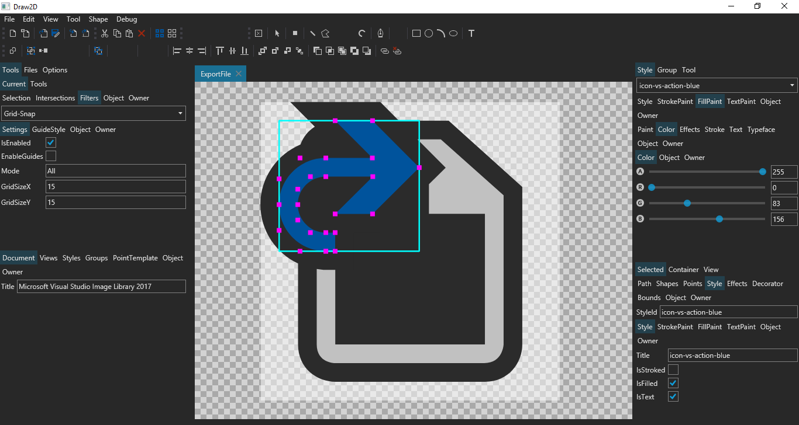

# Draw2D

A multi-platform 2D diagram editor.

## About

Draw2D is a multi-platform application for making 2D diagrams. 

## Resources

* [GitHub source code repository.](https://github.com/wieslawsoltes/Draw2D)
* [Wiki.](https://github.com/wieslawsoltes/Draw2D/wiki)
* [Visual Studio Image Library 2017](https://www.microsoft.com/en-us/download/details.aspx?id=35825)

## License

Draw2D is licensed under the [MIT license](LICENSE.TXT).
